# Probabilistic RNNs for sequential data with missing values

EU project 732328: "Fashion Brain".

D1.4: "Software Requirements: SSM library for time-series modeling and trend prediction".

## Tasks

### Prediction and forecasting

We assume we are given sample paths from a time-series: 
Thus:

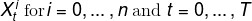

Where the sample paths are all drawn from an underlying model:

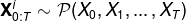

The aim in forecasting is to predict future time-points from sample past time points.
I.e. we would be interested in estimating:

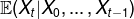

or


In this package we follow the ansatz that the dependency is completely determined by the hidden state of a recurrent neural network.

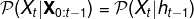

where the RNN recurrence relation is given by:

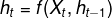

### Distribution modeling with NADE

Here we are interested in estimating the distribution of a multivariate vector without necessarily assuming a temporal or sequential ordering.
Nevertheless we still have a decomposition of the joint distribution:

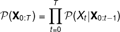

Which may be modeled again using an RNN:

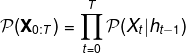

This approach is known as [neural autoregressive distribution estimation (NADE)](http://proceedings.mlr.press/v15/larochelle11a/larochelle11a.pdf).

### Missing value estimation

In many applications missing data is an issue which hampers both training and inference.
Thus we are given a sequence of data where only a subsequence is available. For example:

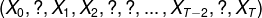

Assume we are given an RNN model:


and a parameterized estimate of the conditional distribution:

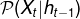

In this package we take a [sequential importance sampling (SIS)](https://en.wikipedia.org/wiki/Particle_filter) approach to inferring missing data given this model of the time-series.
If, additionally, data is missing at training time, we employ an [expectation-maximization (EM)](https://en.wikipedia.org/wiki/Expectation%E2%80%93maximization_algorithm) training algorithm, rather than a standard backpropagation through (BPTT) time algorithm.

### Multivariate temporal dependencies

In the simplest case suppose we have two time series. Temporal dependencies may be modeled by treating the interleaved sequence:

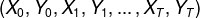

At test time, predicting one unseen time-series given an observed time-series may be treated as a missing value problem and applying SIS to the sequence:

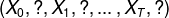


## Python package

### Structure

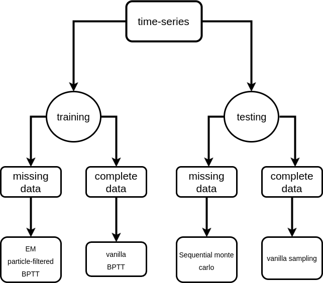

### Getting started

Installation:

``` bash 
git clone https://github.com/zalandoresearch/probrnn.git
cd probnn/
make install
```

Installation in development mode:

``` bash 
git clone https://github.com/zalandoresearch/probrnn.git
cd probnn/
make develop
```

Running the tests:

``` bash
make clean
make test
```

### Usage

Setting up NADE data

```python
from probrnn import data
import numpy as np

x = np.random.randn(1000, 10)
datastruct = data.NadeWrapper(x)
```

Setting up time-series data

```python
x = np.random.randn(10000)
datastruct = data.TimeSeries(x)
```

Setting up parameters for learning
```python
params = \
    {
        "N_ITERATIONS": 10 ** 5, # no of batches to pass in total
        "VALIDATE_EACH": 100, # how often to check error on validation data
        "SAVE_EACH": 1000, # how often to save model
        "LOG_EVERY": 50, # how often to log
        "LEARNING_RATE": 0.0001, # learning rate of learning
        "N_HIDDEN": 256, # number of hidden units in RNN
        "N_BINS": 50, # number of bins to discretize data
        "BATCH_SIZE": 50, # number of samples per batch
    }
```

Get a NADE model
```python
from probrnn import models

model = models.NADE(datastruct, params=params)
```

Do the training
```python
training = models.Training(model, "test_model", "test_log.json")
callback = lambda err, i, _: print "loss: {err}; iteration {i}".format(err=err, i=i)
training.train(callback)
```

Same thing but with missing values
```python
from probrnn import inference

imputer = lambda a, b: inference.NaiveSIS(a, b)
training = models.Training(model, "test_model", "test_log.json", imputer=imputer)
training.train(callback)
```

Do imputation at test time

```python
x[np.random.choice(len(x), replace=False, size=50)] = np.nan
estimate = imputer(model, x).estimate()
```
### Examples

Example notebooks are in ```./examples/```

## License

The MIT License (MIT)
Copyright (c) 2016 Zalando SE

Permission is hereby granted, free of charge, to any person obtaining a copy of this software and associated documentation files (the "Software"), to deal in the Software without restriction, including without limitation the rights to use, copy, modify, merge, publish, distribute, sublicense, and/or sell copies of the Software, and to permit persons to whom the Software is furnished to do so, subject to the following conditions:

The above copyright notice and this permission notice shall be included in all copies or substantial portions of the Software.

THE SOFTWARE IS PROVIDED "AS IS", WITHOUT WARRANTY OF ANY KIND, EXPRESS OR IMPLIED, INCLUDING BUT NOT LIMITED TO THE WARRANTIES OF MERCHANTABILITY, FITNESS FOR A PARTICULAR PURPOSE AND NONINFRINGEMENT. IN NO EVENT SHALL THE AUTHORS OR COPYRIGHT HOLDERS BE LIABLE FOR ANY CLAIM, DAMAGES OR OTHER LIABILITY, WHETHER IN AN ACTION OF CONTRACT, TORT OR OTHERWISE, ARISING FROM, OUT OF OR IN CONNECTION WITH THE SOFTWARE OR THE USE OR OTHER DEALINGS IN THE SOFTWARE.

